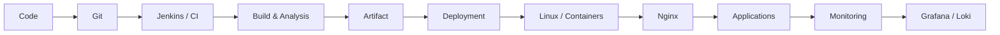
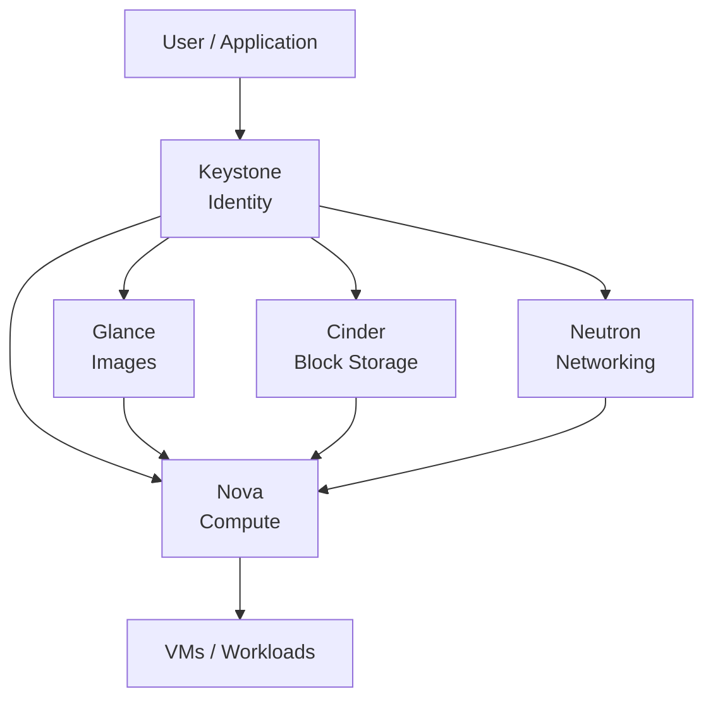
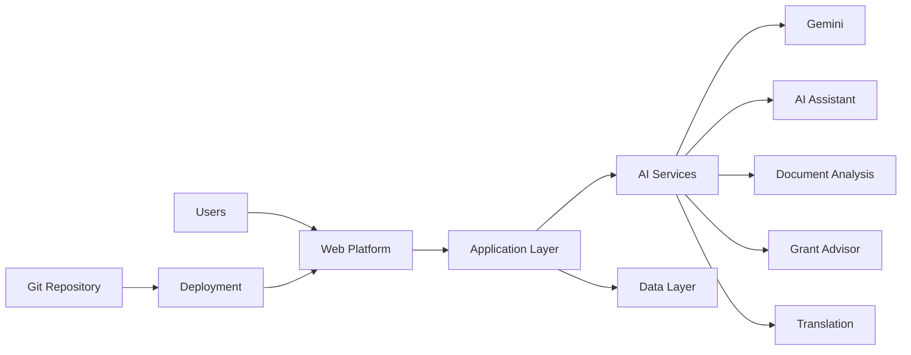
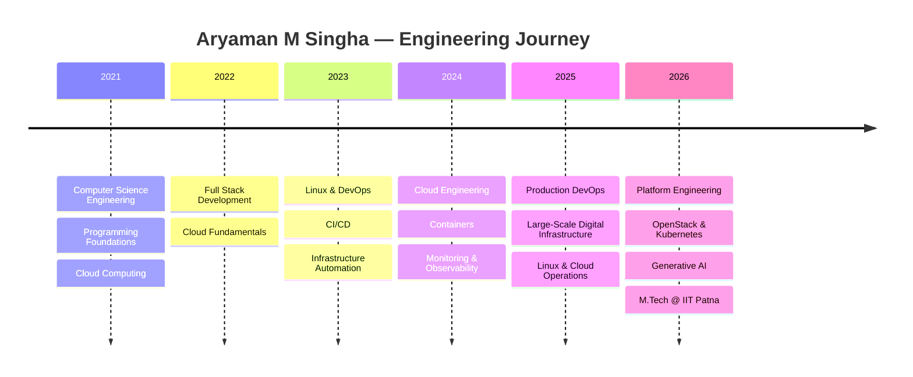

<!-- ========================================================= -->
<!--                    ARYAMAN M SINGHA                       -->
<!--       Cloud • DevOps • Platform • GenAI Engineering       -->
<!-- ========================================================= -->

<p align="center">
  
</p>

<div align="center">


<br/><br/>


<br/><br/>


&nbsp;


</div>

---

# 👨‍💻 Engineering Profile

> **Cloud & DevOps Engineer focused on production infrastructure, platform reliability, deployment automation, observability and cloud-native engineering.**

I work with **production and staging infrastructure supporting large-scale public digital platforms**, with hands-on experience across Linux administration, cloud infrastructure, application deployments, containers, CI/CD, networking, monitoring and incident troubleshooting.

My engineering interests sit at the intersection of:

```text
             Cloud Infrastructure
                      │
                      ▼
             DevOps Automation
                      │
                      ▼
           Platform Engineering
                      │
             ┌────────┴────────┐
             ▼                 ▼
      Cloud Native        Observability
             │                 │
             └────────┬────────┘
                      ▼
               Generative AI
```

🎓 Alongside infrastructure engineering, I am pursuing an **Executive M.Tech in Computer Science & Engineering — Generative AI at IIT Patna**.

---

# ⚡ Engineering Snapshot

<table>
<tr>
<td width="50%" valign="top">

### ☁️ Cloud & Infrastructure

- Microsoft Azure
- AWS
- OpenStack
- Linux Infrastructure
- Virtual Machines
- Cloud Networking
- Load Balancing
- Infrastructure Integration

</td>

<td width="50%" valign="top">

### ♾️ DevOps & Automation

- Jenkins
- GitHub Actions
- GitLab CI/CD
- Terraform
- Bash Automation
- Deployment Automation
- Git-based Workflows
- Infrastructure as Code

</td>
</tr>

<tr>
<td width="50%" valign="top">

### 🐳 Containers & Runtime

- Docker
- Podman
- Kubernetes
- Helm
- Nginx
- Apache
- Apache Tomcat
- Eclipse Jetty

</td>

<td width="50%" valign="top">

### 📊 Observability

- Prometheus
- Grafana
- Loki
- Promtail
- Node Exporter
- cAdvisor
- Zabbix
- CloudWatch

</td>
</tr>
</table>

---

# 🏗️ Production & Platform Engineering

```text
                         USERS
                           │
                           ▼
                 ┌───────────────────┐
                 │ Reverse Proxy /   │
                 │ Load Balancing    │
                 └─────────┬─────────┘
                           │
             ┌─────────────┴─────────────┐
             │                           │
             ▼                           ▼
      ┌──────────────┐            ┌──────────────┐
      │ Application  │            │ Containerized│
      │ Runtime      │            │ Workloads    │
      │ Jetty/Tomcat │            │ Docker/Podman│
      └──────┬───────┘            └──────┬───────┘
             │                           │
             └─────────────┬─────────────┘
                           │
                           ▼
                 ┌───────────────────┐
                 │ APIs / Services   │
                 │ Data / Backends   │
                 └─────────┬─────────┘
                           │
                           ▼
             ┌───────────────────────────┐
             │      OBSERVABILITY        │
             │ Prometheus • Grafana      │
             │ Loki • Zabbix • Alerts    │
             └───────────────────────────┘
```

### What I work with

- 🐧 Linux server administration & troubleshooting
- 🚀 Production and staging deployment support
- 🔁 CI/CD pipelines & deployment automation
- ☁️ Cloud workload integration & validation
- 🐳 Docker & Podman container operations
- ☸️ Kubernetes & cloud-native infrastructure
- 🌐 Nginx reverse proxy & application routing
- 🔐 SSH, VPN, firewall & connectivity troubleshooting
- 📡 DNS, HTTP/S, ports & network-path validation
- 📊 Monitoring, logging & infrastructure observability
- 🚨 Incident investigation & root-cause analysis
- ⚙️ Jetty & Tomcat application deployments
- 🏗️ Infrastructure automation with Terraform

---

# 🇮🇳 Large-Scale Digital Infrastructure

My professional experience includes infrastructure and DevOps support within the **NIC ecosystem**, supporting digital transport platforms and associated production/staging environments.

### Platform Exposure

<div align="center">

`mParivahan` • `eChallan` • `NHAI` • `eChitra` • `Delhi Traffic Systems`

</div>

```text
               DIGITAL TRANSPORT PLATFORMS
                           │
         ┌─────────────────┼──────────────────┐
         │                 │                  │
         ▼                 ▼                  ▼
    Applications        APIs             Services
         │                 │                  │
         └─────────────────┼──────────────────┘
                           ▼
                 Infrastructure Layer
                           │
         ┌─────────────────┼─────────────────┐
         ▼                 ▼                 ▼
       Linux           Cloud / VMs       Networking
         │                 │                 │
         └─────────────────┼─────────────────┘
                           ▼
                  Application Runtime
               Jetty • Tomcat • Containers
                           │
                           ▼
                      Monitoring
             Prometheus • Grafana • Loki
```

### Core Responsibilities

**Infrastructure**

`Linux` • `Cloud VMs` • `Networking` • `SSH` • `VPN` • `Firewall`

**Application Runtime**

`Jetty` • `Tomcat` • `Nginx` • `Podman` • `Docker`

**Operations**

`Deployment` • `Monitoring` • `Incident Response` • `RCA` • `Log Analysis`

**Observability**

`Prometheus` • `Grafana` • `Loki` • `Promtail` • `Zabbix`

---

# 🔁 DevOps Delivery Workflow



<div align="center">

### `Build → Test → Analyze → Package → Deploy → Observe → Improve`

</div>

> **Engineering Goal:** Make deployments repeatable, infrastructure observable, failures diagnosable and operations automatable.

---

# ☁️ OpenStack & Cloud Infrastructure

My platform-engineering focus includes **OpenStack architecture, infrastructure operations and workload integration**.



### OpenStack Stack

| Service | Engineering Area |
|:---:|:---|
| **Nova** | Compute |
| **Neutron** | Networking |
| **Cinder** | Block Storage |
| **Keystone** | Identity & Authentication |
| **Glance** | Image Management |

---

# ☸️ Kubernetes & Cloud Native

```text
                     Kubernetes
                         │
          ┌──────────────┼──────────────┐
          ▼              ▼              ▼
     Deployments      Services         Pods
          │              │              │
          └──────────────┼──────────────┘
                         ▼
                    Applications
                         │
                         ▼
                 Observability
```

### Current Focus

- Kubernetes administration
- Container orchestration
- Helm
- Service networking
- Cloud-native deployments
- GitOps concepts
- Platform engineering
- Infrastructure automation

---

# 🛠️ Technology Arsenal

<div align="center">

### ☁️ Cloud


<br/>

`OpenStack` • `Cloud Networking` • `Virtualization`

<br/><br/>

### ♾️ DevOps & Infrastructure


<br/><br/>

### 🐳 Containers & Platform


<br/>

`Podman` • `Helm` • `Tomcat` • `Jetty`

<br/><br/>

### 📊 Observability


<br/>

`Loki` • `Promtail` • `Zabbix` • `Node Exporter` • `cAdvisor` • `CloudWatch`

<br/><br/>

### 💻 Development


</div>

---

# 🧠 Skills Matrix

| Engineering Domain | Technologies |
|---|---|
| ☁️ **Cloud** | Azure • AWS • OpenStack • GCP Fundamentals |
| 🐧 **Systems** | Linux • Ubuntu • Systemd • Bash |
| 🐳 **Containers** | Docker • Podman • Kubernetes • Helm |
| ♾️ **CI/CD** | Jenkins • GitHub Actions • GitLab CI/CD |
| 🏗️ **Infrastructure as Code** | Terraform • CloudFormation Fundamentals |
| 🌐 **Networking** | DNS • HTTP/S • SSH • VPN • NAT • Load Balancing |
| 🚦 **Application Infrastructure** | Nginx • Apache • Jetty • Tomcat |
| 📊 **Observability** | Prometheus • Grafana • Loki • Zabbix • CloudWatch |
| 💻 **Programming** | Python • Java • C/C++ • JavaScript • TypeScript |
| 🗄️ **Database** | MongoDB |
| 🤖 **AI** | Generative AI • LLM Integration • Gemini |

---

# 🤖 DevOps × Cloud × Generative AI

I'm particularly interested in combining **traditional infrastructure engineering with Generative AI and intelligent automation**.

```text
                    Generative AI
                         │
          ┌──────────────┼──────────────┐
          ▼              ▼              ▼
    Log Analysis    Ops Assistance    Automation
          │              │              │
          └──────────────┼──────────────┘
                         ▼
                        AIOps
                         │
                         ▼
              Intelligent Infrastructure
```

### Areas I'm Exploring

- 🧠 AI-assisted incident investigation
- 📊 Intelligent log analysis
- 🤖 LLM-powered operational assistants
- 📚 Automated technical documentation
- 🔍 AI-assisted root-cause analysis
- ⚙️ Infrastructure automation
- ☁️ AI + cloud infrastructure integration

---

# 🚀 Featured Project

## 🌸 Leimarembi Foundation — AI-Enabled Digital Platform

A community-focused digital platform combining **web engineering, cloud deployment and Generative AI capabilities**.



### AI Capabilities

- 🤖 Conversational AI assistant
- 📝 Meeting-minutes generation
- 📑 Document analysis
- 💡 Grant advisory
- 🌐 Multilingual assistance
- 🧠 Local deterministic fallback engine
- ☁️ Cloud-hosted deployment

---

# 🎓 Education

<table>
<tr>
<td width="50%" valign="top">

### 🏛️ Indian Institute of Technology Patna

**Executive M.Tech**

Computer Science & Engineering

**Specialization:** Generative AI

`2026 — 2028`

</td>

<td width="50%" valign="top">

### 🎓 Chandigarh University

**Bachelor of Technology**

Computer Science & Engineering

**Specialization:** Cloud Computing

`2021 — 2025`

</td>
</tr>
</table>

---

# 🏆 Certifications

<div align="center">


<br/>


</div>

---

# 🏅 Engineering & Coding Highlights

<div align="center">

### `900+ LeetCode Problems` • `120+ GitHub Repositories` • `C++ HackerRank 4★`

</div>

- 💻 Extensive problem-solving practice across algorithms and data structures
- 🥋 Karate Black Belt
- 🏆 Competitive programming & technical community participation
- 🛠️ Active project development across Cloud, DevOps, Web and AI

---

# 📊 GitHub Engineering Dashboard

<div align="center">


</div>

<br/>

<div align="center">


</div>

---

# 🏆 GitHub Achievements

<div align="center">


</div>

---

# 🐍 Contribution Activity

<div align="center">


</div>

> The contribution snake requires a GitHub Actions workflow generating the `output` branch. If you haven't configured it yet, remove this section temporarily.

---

# 🛣️ Engineering Journey



---

# 🎯 Current Engineering Focus

```text
Linux / Systems       ████████████████████░░  Production
Cloud & DevOps        ████████████████████░░  Production
CI/CD Automation      ███████████████████░░░  Strong
Observability         ███████████████████░░░  Strong
Containers            ██████████████████░░░░  Strong
OpenStack             ████████████████░░░░░░  Developing
Kubernetes            ████████████████░░░░░░  Developing
Generative AI         ██████████████░░░░░░░░  Developing
```

---

# 💡 Engineering Philosophy

<div align="center">

### `Automate what repeats.`

### `Observe what matters.`

### `Debug with evidence.`

### `Design for reliability.`

</div>

---

# 🤝 Let's Connect

<div align="center">

### Open to opportunities in

**Cloud Engineering • DevOps • Platform Engineering • SRE • OpenStack • Kubernetes • AI Infrastructure**

<br/>

<a href="https://github.com/Aryamnsls">
  
</a>

<br/><br/>


</div>

<br/>

<p align="center">
  <b>☁️ CLOUD &nbsp;•&nbsp; ♾️ DEVOPS &nbsp;•&nbsp; ☸️ PLATFORM &nbsp;•&nbsp; 🤖 AI</b>
</p>

<p align="center">
  
</p>
