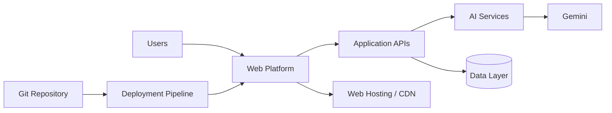
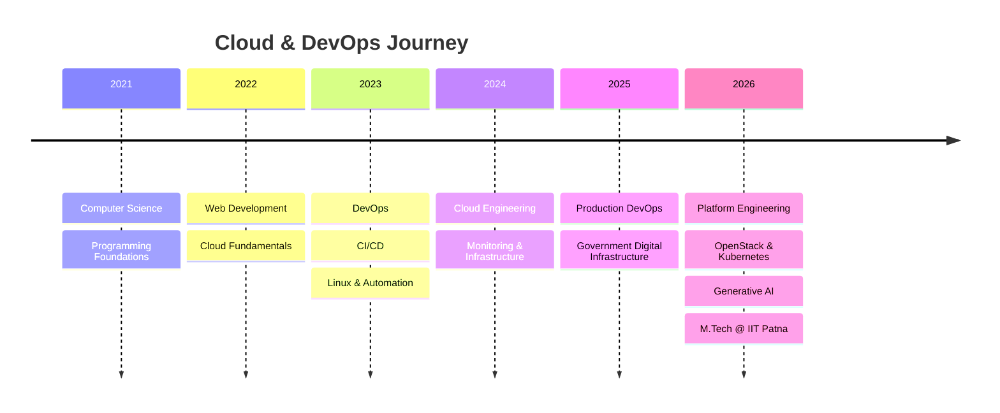

<!-- ===================== HERO ===================== -->

<div align="center">


<br/>

<a href="https://github.com/Aryamnsls">

</a>


</div>

---

## 👨‍💻 About Me

```yaml
name: Aryaman M Singha
role: Cloud & DevOps Engineer
focus:
  - Cloud Infrastructure
  - DevOps & Platform Engineering
  - Linux Administration
  - CI/CD Automation
  - Observability
  - OpenStack
  - Kubernetes

currently_learning:
  - Generative AI
  - Advanced Kubernetes
  - Cloud Native Architecture
  - AIOps

philosophy: "Automate what repeats. Monitor what matters. Engineer for reliability."
```

I work on **production and staging infrastructure** supporting large-scale digital platforms, with hands-on experience across Linux, cloud infrastructure, deployment automation, observability, networking, containers, and incident troubleshooting.

My work primarily revolves around turning application deployments into **reliable, observable and repeatable infrastructure workflows**.

---

## ⚡ What I Work With

<div align="center">

### ☁️ Cloud & Infrastructure


### ♾️ DevOps & CI/CD


### 📊 Observability


`Loki` • `Promtail` • `Node Exporter` • `cAdvisor` • `Zabbix` • `CloudWatch`

### 💻 Development


</div>

---

## 🏗️ Engineering Experience

```text
                    ┌──────────────────┐
                    │    Git / SCM     │
                    └────────┬─────────┘
                             │
                             ▼
                    ┌──────────────────┐
                    │ Jenkins / CI-CD  │
                    └────────┬─────────┘
                             │
                    ┌────────▼─────────┐
                    │ Build & Analysis │
                    │ Maven / SonarQube│
                    └────────┬─────────┘
                             │
                    ┌────────▼─────────┐
                    │ Artifact / Image │
                    │ Nexus / Registry │
                    └────────┬─────────┘
                             │
                             ▼
              ┌────────────────────────────┐
              │ Deployment Infrastructure  │
              │ Linux • Docker • Podman    │
              │ Kubernetes • Jetty • Nginx │
              └──────────────┬─────────────┘
                             │
                             ▼
              ┌────────────────────────────┐
              │ Observability & Operations │
              │ Prometheus • Grafana • Loki│
              │ Zabbix • Alerting • RCA    │
              └────────────────────────────┘
```

---

## 🚦 Production & Platform Engineering

- ⚙️ Linux administration and production troubleshooting
- ☁️ Cloud infrastructure and workload integration
- 🐳 Docker & Podman containerized workloads
- ☸️ Kubernetes and cloud-native infrastructure
- 🔁 CI/CD pipelines and deployment automation
- 🌐 Nginx reverse proxy and application routing
- 🔐 SSH, VPN, firewall and network troubleshooting
- 📊 Prometheus, Grafana, Loki & Zabbix observability
- 🧩 Application deployment on Jetty/Tomcat
- 🛠️ Incident response, log analysis and RCA
- 🏗️ Infrastructure as Code with Terraform
- ☁️ OpenStack infrastructure operations

---

## 🧠 Core Engineering Stack

| Domain | Technologies |
|---|---|
| **Cloud** | AWS • Azure • GCP • OpenStack |
| **Containers** | Docker • Podman • Kubernetes |
| **CI/CD** | Jenkins • GitHub Actions • GitLab CI/CD |
| **IaC** | Terraform • CloudFormation |
| **Monitoring** | Prometheus • Grafana • Loki • Zabbix • CloudWatch |
| **Web / Proxy** | Nginx • Apache |
| **Operating Systems** | Linux • Ubuntu |
| **Networking** | DNS • HTTP/S • SSH • VPN • NAT • Load Balancing |
| **Scripting** | Bash • Python • PowerShell |
| **Development** | Java • C++ • JavaScript • TypeScript |
| **Databases** | MongoDB |

---

## 🚀 Featured Project — Leimarembi Foundation

**AI-enabled digital platform combining Cloud, DevOps and Generative AI.**



### AI Capabilities

- 🤖 AI conversational assistant
- 📝 Meeting-minutes generation
- 📑 Document analysis
- 💡 Grant advisory
- 🌐 Multilingual assistance
- 🧠 Local fallback processing

---

## 🎓 Education

### Indian Institute of Technology Patna
**Executive M.Tech — Computer Science & Engineering**  
**Specialization: Generative AI**  
`2026 – 2028`

### Chandigarh University
**B.Tech — Computer Science & Engineering**  
**Cloud Computing**

---

## 🏆 Certifications & Learning

<p align="center">


</p>

---

## 📈 GitHub Analytics

<div align="center">


</div>

<div align="center">


</div>

---

## 🏅 GitHub Achievements

<div align="center">


</div>

---

## 🐍 Contribution Activity

<div align="center">


</div>

---

## 🛣️ Engineering Journey



---

## 🎯 Current Focus

```text
☁️  Cloud Architecture
████████████████████░░░░  85%

♾️  DevOps / CI-CD
█████████████████████░░░  90%

🐧  Linux
██████████████████████░░  92%

🐳  Containers
████████████████████░░░░  85%

☸️  Kubernetes
████████████████░░░░░░░░  70%

🏗️  OpenStack
████████████████░░░░░░░░  70%

🤖  Generative AI
██████████████░░░░░░░░░░  60%
```

---

## 🤝 Let's Connect

<div align="center">

<a href="https://github.com/Aryamnsls">

</a>

<br/><br/>

### ☁️ Cloud • ♾️ DevOps • ☸️ Kubernetes • 🤖 AI

**Build. Automate. Observe. Improve.**

</div>


